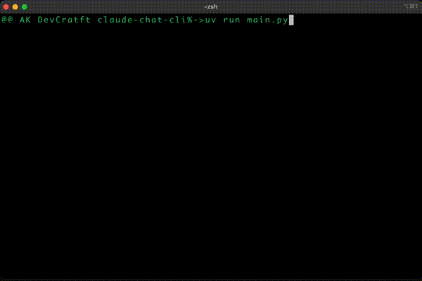
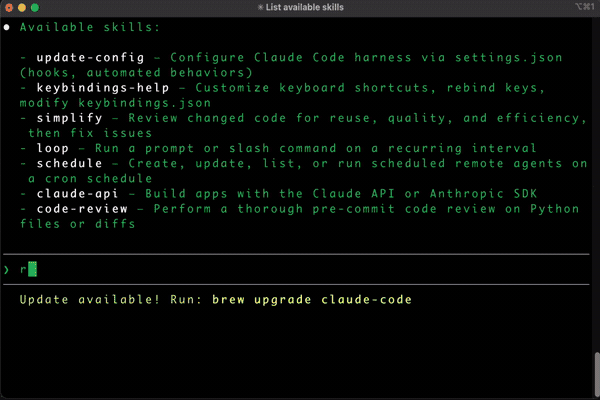
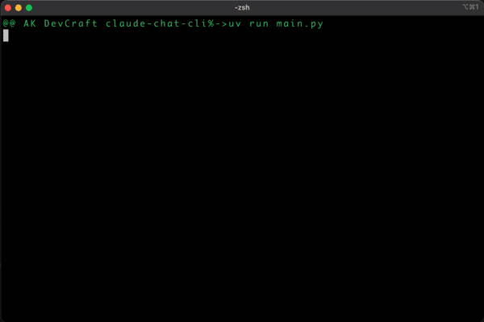

# Introduction
This project is based on startup kit from Anthropic academy's Introduction to Model Context Protocol course

Link - https://anthropic.skilljar.com/introduction-to-model-context-protocol

# MCP Chat

MCP Chat is a command-line interface application that enables interactive chat capabilities with AI models through the Anthropic API. The application supports document retrieval, command-based prompts, and extensible tool integrations via the MCP (Model Control Protocol) architecture.

## Demo

### MCP Demo



### Skills Demo



### Logging and Notification Demo



## Prerequisites

- Python 3.9+
- Anthropic API Key

## Setup

### Step 1: Configure the environment variables

1. Copy `.env.example` to `.env` and set your Anthropic API key:

```bash
cp .env.example .env
# Edit .env and set ANTHROPIC_API_KEY
```

2. Ensure `.env` is ignored by Git (`.gitignore` already includes .env).

3. Run the local secret scanner before committing:

```bash
python scripts/secret_scan.py
```

### Secret scanning policy

- Never store real API keys in source-controlled files.
- For CI checks, add the scanner to your GitHub Actions or pre-commit hook.

  Example pre-commit entry (optional):

  ```yaml
  repos:
    - repo: local
      hooks:
        - id: secret-scan
          name: secret-scan
          entry: python scripts/secret_scan.py
          language: system
          types: [file]
  ```

### Step 2: Install dependencies

#### Option 1: Setup with uv (Recommended)

[uv](https://github.com/astral-sh/uv) is a fast Python package installer and resolver.

1. Install uv, if not already installed:

```bash
pip install uv
```

2. Create and activate a virtual environment:

```bash
uv venv
source .venv/bin/activate  # On Windows: .venv\Scripts\activate
```

3. Install dependencies:

```bash
uv pip install -e .
```

4. Run the project

```bash
uv run main.py
```

#### Option 2: Setup without uv

1. Create and activate a virtual environment:

```bash
python -m venv .venv
source .venv/bin/activate  # On Windows: .venv\Scripts\activate
```

2. Install dependencies:

```bash
pip install anthropic python-dotenv prompt-toolkit "mcp[cli]==1.8.0"
```

3. Run the project

```bash
python main.py
```

## Usage

### Basic Interaction

Simply type your message and press Enter to chat with the model.

### Document Retrieval

Use the @ symbol followed by a document ID to include document content in your query:

```
> Tell me about @deposition.md
```

### Commands

Use the / prefix to execute commands defined in the MCP server:

```
> /summarize deposition.md
```

Commands will auto-complete when you press Tab.

## Development

### Adding New Documents

Edit the `mcp_server.py` file to add new documents to the `docs` dictionary.

### Implementing MCP Features

To fully implement the MCP features:

1. Complete the TODOs in `mcp_server.py`
2. Implement the missing functionality in `mcp_client.py`

### Linting and Typing Check

There are no lint or type checks implemented.

### Run server inspector

1. Activate the virtual env - `source .venv/bin/activate` and to deactivate `deactivate` or use `uv run`
2. Run server inspector in browser - `mcp dev mcp_server.py` - alternatively use cmd `uv run mcp dev mcp_server.py`
3. Copy the session token generated and configure it the MCP Inspector page under configuration.
